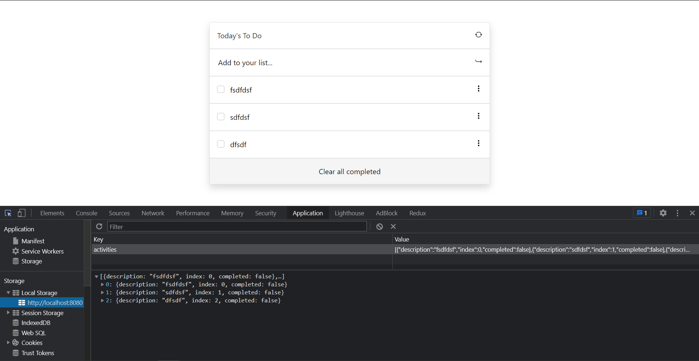

# To Do List

> This is a JavaScript project in which a user can add tasks that must be done in the day.

## Built With

- HTML
- CSS
- JavaScript
- ESLint
## Live Demo

[Live Demo Link](https://raw.githack.com/aristides1000/to-do-list/ft-add-remove/dist/index.html)

## Getting Started
Clone this repo on your local machine

### Prerequisites
To make this repository working in your local machine you need only a browser.

## Author

👤 **Arístides José Molina Pérez**

- Github: [@aristides1000](https://github.com/aristides1000)
- Twitter: [@aristides_1000](https://twitter.com/aristides_1000)
- Linkedin: [Aristides Jose Molina Perez](https://www.linkedin.com/in/aristides-molina/)

## 🤝 Contributing

Contributions, issues and feature requests are welcome!

Feel free to check the [issues page](https://aristides1000.github.io/to-do-list/).

## Show your support

Give a ⭐️ if you like this project!

## Acknowledgments

- Ariel Camus CEO Microverse: For letting us start this journey.
- Google: For letting us find crucial information in order to create this project.

## 📝 License

This project is [CC0-1.0](LICENSE) licensed.
